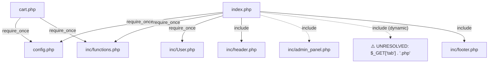

# Dependency Graph

Generated from static analysis of `include`/`require`/`include_once`/`require_once` chains, starting at the entry point(s) below. Paths are relative to `/Users/yunjisang/Workspace/krmedics/legacy-php-skills/php-analysis/example/app`.

## Entry points

- `index.php`
- `cart.php`

## File graph (Mermaid)

## Edges (detail)

| From | To | Type | Conditional | In function | Notes |
|---|---|---|---|---|---|
| `index.php`:8 | `config.php` | require_once | no | no |  |
| `index.php`:9 | `inc/functions.php` | require_once | no | no |  |
| `index.php`:10 | `inc/User.php` | require_once | no | no |  |
| `index.php`:12 | `inc/header.php` | include | no | no |  |
| `index.php`:25 | `inc/admin_panel.php` | include | yes | no |  |
| `index.php`:31 | **UNRESOLVED** | include | yes | no | dynamic target: `$_GET['tab'] . '.php'` |
| `index.php`:34 | `inc/footer.php` | include | no | no |  |
| `cart.php`:8 | `config.php` | require_once | no | no |  |
| `cart.php`:9 | `inc/functions.php` | require_once | no | no |  |

## ⚠️ Unresolved / dynamic includes (1)

These could not be resolved to a concrete file by static analysis alone (dynamic path built from a variable, function return value, or unrecognized constant). Read them manually — they may pull in files not otherwise listed in this graph.

- `index.php`:31 — `$_GET['tab'] . '.php'` (conditional)
