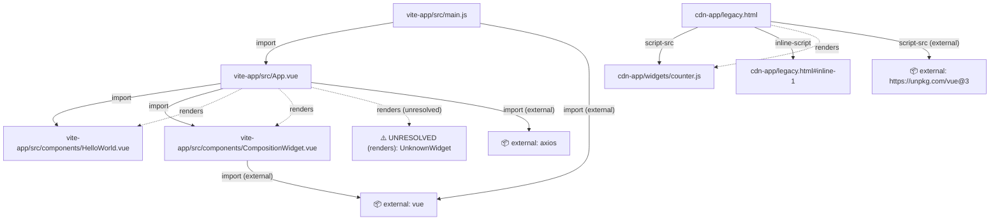

# Dependency Graph

File/component graph: ES `import`/dynamic `import()` (Vite), `<script src>`/inline `<script>` (CDN HTML), and `renders` edges (a template's custom-tag usage resolved to the file defining that component). Paths relative to `/Users/yunjisang/Workspace/krmedics/legacy-php-skills/vue-analysis/example`.

## Entry points

- `vite-app/src/main.js`
- `cdn-app/legacy.html`

## File graph (Mermaid)

## Edges (detail)

| From | To | Type |
|---|---|---|
| `vite-app/src/main.js` | `vite-app/src/App.vue` | import |
| `cdn-app/legacy.html` | `cdn-app/widgets/counter.js` | script-src |
| `cdn-app/legacy.html` | `cdn-app/legacy.html#inline-1` | inline-script |
| `vite-app/src/App.vue` | `vite-app/src/components/HelloWorld.vue` | import |
| `vite-app/src/App.vue` | `vite-app/src/components/CompositionWidget.vue` | import |
| `cdn-app/legacy.html` | `cdn-app/widgets/counter.js` | renders |
| `vite-app/src/App.vue` | `vite-app/src/components/HelloWorld.vue` | renders |
| `vite-app/src/App.vue` | `vite-app/src/components/CompositionWidget.vue` | renders |

## 📦 External packages / CDN URLs (4)

Not part of this project's own file graph - expected, not a gap.

- `vite-app/src/main.js` — import: `vue`
- `cdn-app/legacy.html` — script-src: `https://unpkg.com/vue@3`
- `vite-app/src/App.vue` — import: `axios`
- `vite-app/src/components/CompositionWidget.vue` — import: `vue`

## ⚠️ Unresolved (1)

Could not be statically resolved to a file/component - a computed import path, a dynamic `<component :is>`, or a template tag with no matching local/global component definition found.

- `vite-app/src/App.vue` — renders: `UnknownWidget`
